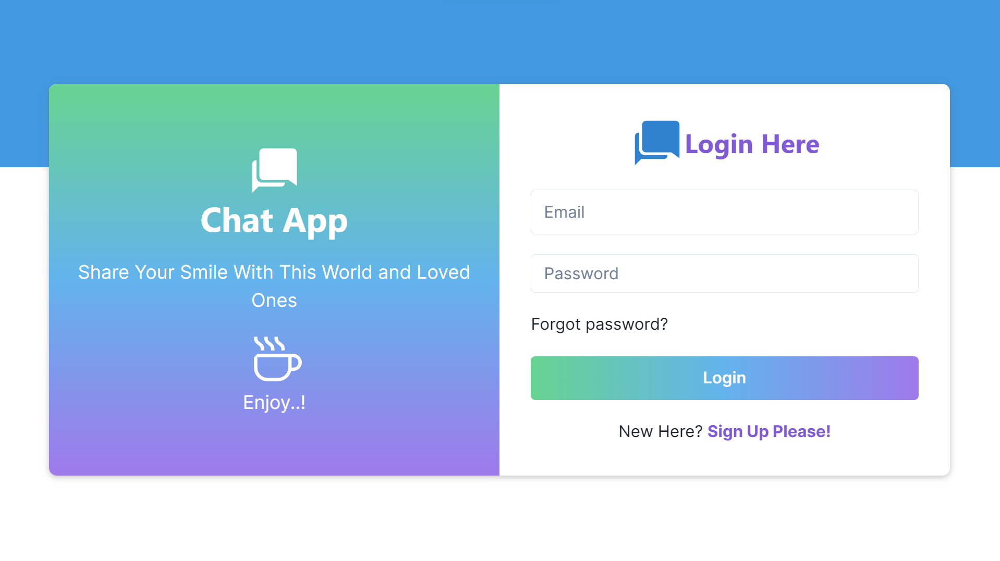
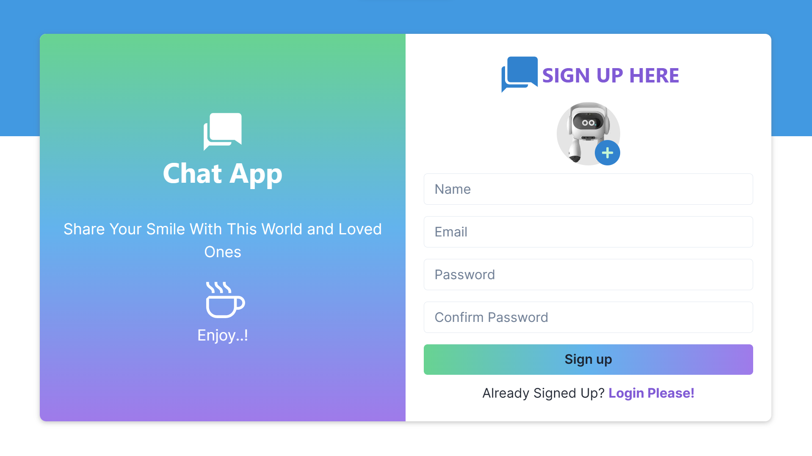
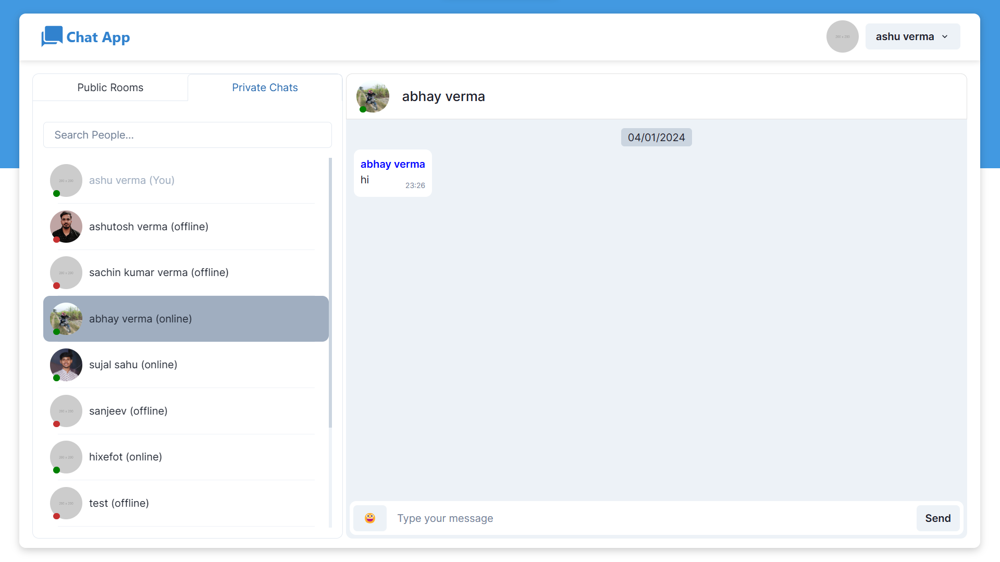

# Chat-App

Chat-App is a dynamic real-time messaging platform designed for seamless communication. Users can effortlessly sign up, securely log in, and actively participate in vibrant public groups. The application fosters a sense of community by enabling users to share their thoughts and ideas openly. Additionally, Chat-App prioritizes privacy with a robust private messaging feature, empowering users to connect on a more personal level through one-on-one conversations.

## Deployment Links

<a href="https://own-chat-app.vercel.app/">Chat App</a>

[Frontend Repository](https://github.com/1ashutoshverma/chat-app-frontend)

[Backend Repository](https://github.com/1ashutoshverma/chat-app-backend)

## Technologies Used

### Frontend

- Next.js
- Chakra UI
- Redux
- TypeScript

### Backend

- Node.js
- Express
- Passport
- Socket.io

### Database

- MongoDB

### Deployment

- Vercel (frontend)
- AWS (backend)
- Nginx
- Certbot

# Screen Shots

## Login

## Singup

## Main Chat

# Contributer

This is a solo project made by <b>Ashutosh Verma</b>

- [Ashutosh Verma (GitHub)](https://github.com/1ashutoshverma)
- [Ashutosh Verma (LinkedIn)](https://www.linkedin.com/in/1ashutoshverma/)
